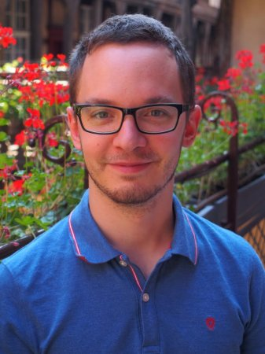

Je suis diplômé d’une école d’ingénieur (l’ESPCI). Mon cursus inclut une année d’Erasmus en Norvège (NTNU) où j’ai plus spécifiquement étudié l’environnement. Entrer en contact avec les connaissances scientifiques sur ce sujet m’a convaincu que nos sociétés font face à de gros problèmes environnementaux qui vont beaucoup jouer sur leur développement futur.

C’est avec cette conviction que je me suis lancé dans un doctorat dans les sciences de l’environnement. A l’époque, c’était ma façon de contribuer à la lutte contre les problèmes environnementaux. Mon doctorat (Disponible ici avec un résumé) avait pour cadre l’analyse du cycle de vie, une méthode d’évaluation multicritère des impacts environnementaux d’un produit. Cette méthode touchant à beaucoup de problèmes environnementaux différents, ça m’a permis de me familiariser avec de nombreux sujets que je traite ici et sur ma chaîne. C’est aussi à ma formation scientifique que je dois mon approche analytique et ma préférence marquée pour des sources scientifiques de première main quand je traite un sujet.

Au cours de mon doctorat, je me suis vite rendu compte que les problèmes environnementaux avaient plus besoin de réponses économiques, politiques et culturelles que de connaissances scientifiques plus approfondies. On sait très bien ce qui cause le changement climatique ou la perte de biodiversité, le problème c’est qu’on n’y fait pas grand-chose ! Fort de ce constat, je me suis lancé dans une activité de vulgarisation (la chaîne YouTube Le Réveilleur), en parallèle de mon doctorat. Ce qui n’a pas toujours été de tout repos !

Mon doctorat en poche, je suis toujours aussi convaincu de l’importance des enjeux environnementaux et d’une bonne vulgarisation à leur sujet. Mon activité de vulgarisation est aujourd’hui mon activité principale.

J’espère que vous trouverez des informations intéressantes sur ce site et sur ma [chaîne Youtube](https://www.youtube.com/@LeReveilleur).

