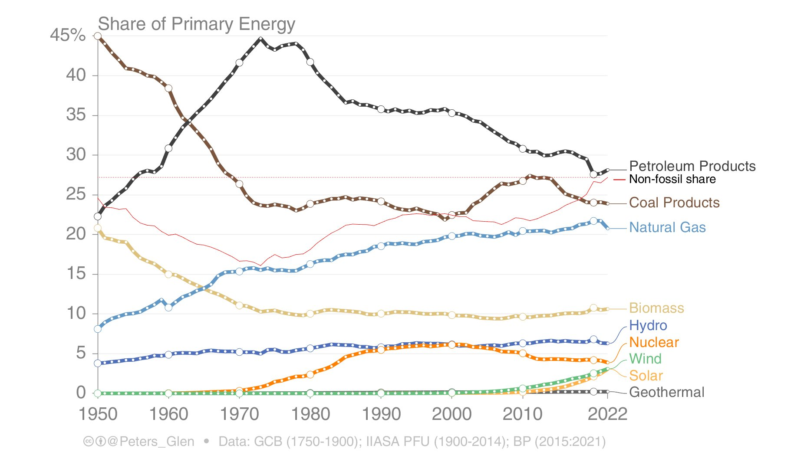
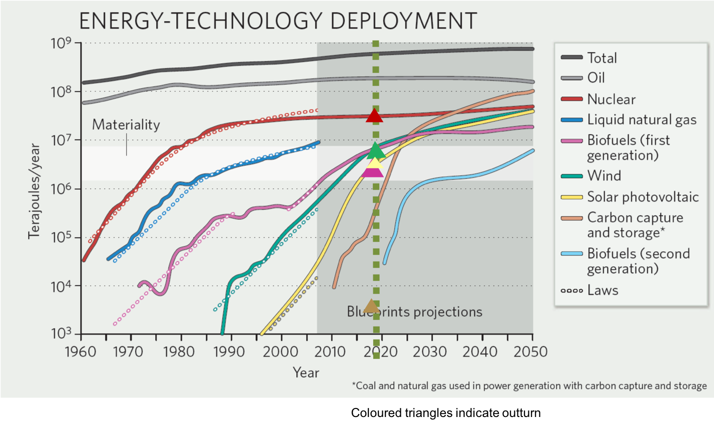
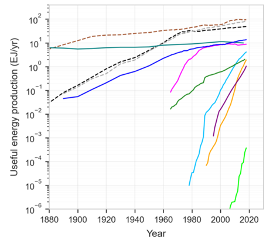
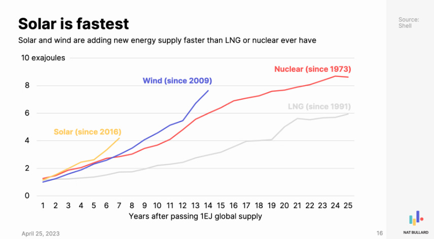
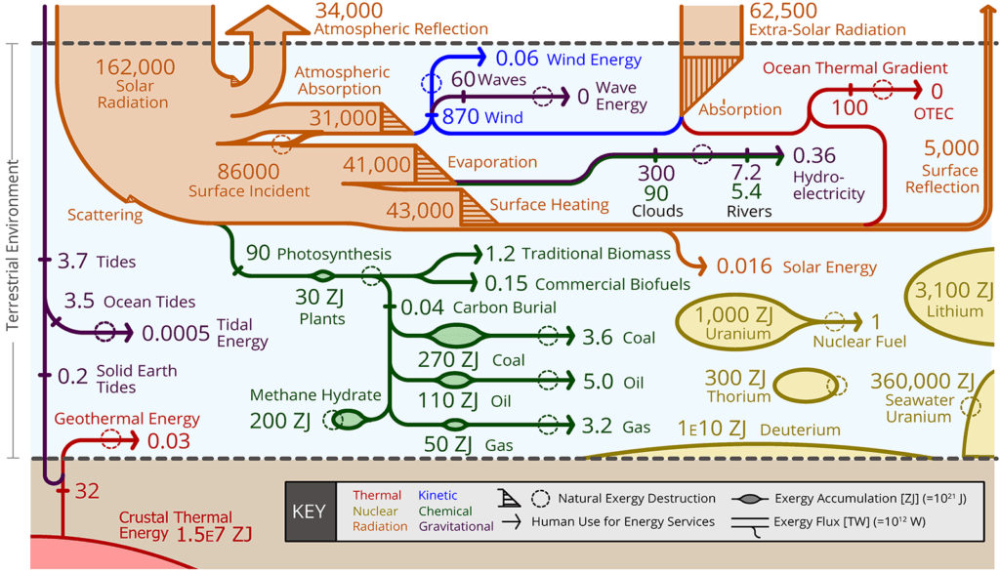
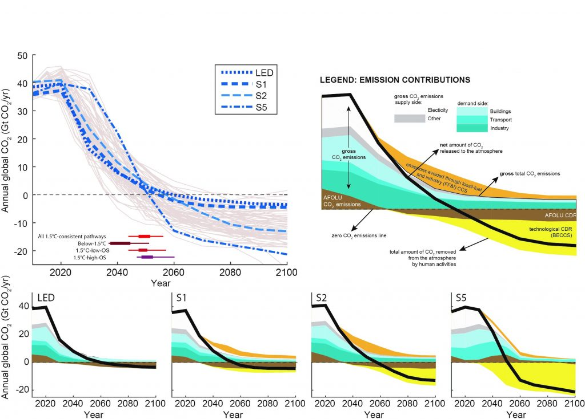
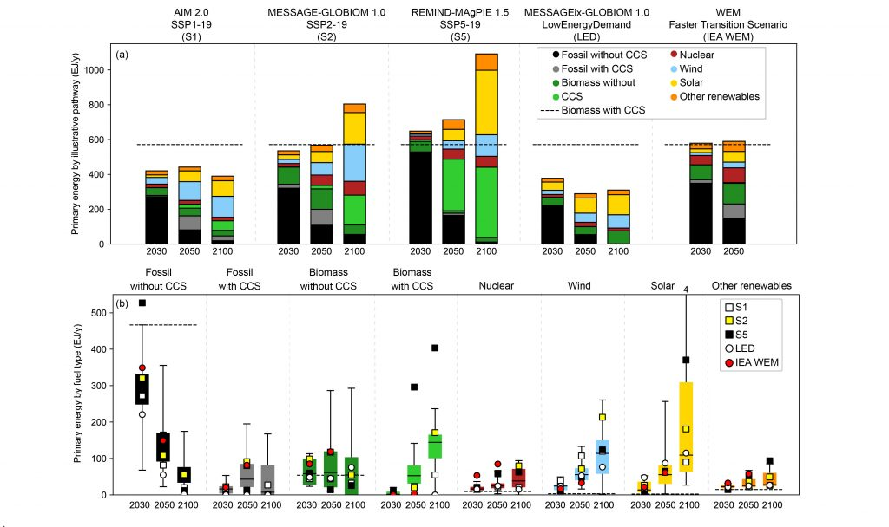

## Vidéo



Le taux de retour énergétique est le ratio entre l’énergie délivrée par un système énergétique et l’énergie investie dans ce système. J'essaye de comprendre quelles sont les implications de ce concept pour la transition énergétique et j'analyse certains discours qui s'en servent.

## Sources bibliographiques

[La vidéo d’Osons Causer sur Jean-Baptiste Fressoz](https://youtu.be/ZB20mjWYQKM) relève d’une logique similaire et devrait vous plaire.



### Articles principaux utilisés

- Murphy, D. J., Raugei, M., Carbajales-Dale, M., & Rubio Estrada, B. (2022). [Energy return on investment of major energy carriers: Review and harmonization](https://www.mdpi.com/2071-1050/14/12/7098). _Sustainability_, 14(12), 7098.
- Brockway, P. E., Owen, A., Brand-Correa, L. I., & Hardt, L. (2019). [Estimation of global final-stage energy-return-on-investment for fossil fuels with comparison to renewable energy sources](https://www.nature.com/articles/s41560-019-0425-z). _Nature Energy_, 4(7), 612-621.
- Slameršak, A., Kallis, G., & O’Neill, D. W. (2022). [Energy requirements and carbon emissions for a low-carbon energy transition](https://www.nature.com/articles/s41467-022-33976-5). _Nature communications_, 13(1), 6932.
- Delannoy, L., Auzanneau, M., Andrieu, B., Vidal, O., Longaretti, P. Y., Prados, E., … & Hall, C. (2023). [Emerging consensus on net energy paves the way for improved integrated assessment modeling](https://papers.ssrn.com/sol3/papers.cfm?abstract_id=4500020).
- Le rapport de RTE [Futurs Énergétiques 2050](https://www.rte-france.com/analyses-tendances-et-prospectives/bilan-previsionnel-2050-futurs-energetiques) (février 2022)
- [Le troisième groupe de travail du sixième rapport du GIEC](https://www.ipcc.ch/report/ar6/wg3/) mentionne peu le taux de retour énergétique. Pour la partie sur le potentiel des renouvelables, je m’appuie sur la figure 7 et le point C12 du résumé à l’intention des décideurs :

> Mitigation options costing USD100 tCO2-eq–1 or less could reduce global GHG emissions by at least half the 2019 level by 2030 (high confidence). 
> — <cite>GIEC: Résumé à l'intention des décideur</cite>

#### Articles de vulgarisation

- [Évolution historique et tendancielle de l’EROI du pétrole et du gaz](https://www.annales.org/re/2023/re111/2023-07-08.pdf) – Annales des Mines
- [Overview of the EROI, a tool to measure energy availability through the energy transition](https://hal.science/hal-03780085v1/file/Final%20Paper%20-%20Final%20approach%20-%20open%20access.pdf) – Kevin Pahud & Greg de Temmerman

#### Données sur les différentes sources d’énergie

- [Définitions sur l’énergie primaire/secondaire/finale/utile](https://ourworldindata.org/energy-definitions), _Our World In Data_
- [Quantités de ressources fossiles utilisées par l’humanité](https://www.sustainabilitybynumbers.com/p/mining-low-carbon-vs-fossil), _Hannah Ritchie_
- [Production d’électricité en Europe](https://ourworldindata.org/grapher/electricity-prod-source-stacked?country=~European+Union+%2827%29+%28Ember%29), _Our World In Data_. Pour l’Union Européenne, je me suis directement servi des données fournies par _Ember_ dans sa [Revue de l’électricité 2023 pour l’Europe](https://ember-climate.org/insights/research/european-electricity-review-2023/).
- [Production d’électricité en Chine](https://ourworldindata.org/grapher/electricity-prod-source-stacked?country=~CHN), _Our World In Data_
- [Production d’électricité dans le monde](https://ourworldindata.org/grapher/electricity-production-by-source), _Our World In Data_
- [Énergie primaire dans le monde](https://ourworldindata.org/grapher/global-primary-energy), _Our World In Data_
- [La méthode de substitution](https://ourworldindata.org/energy-substitution-method), _Our World In Data_ (et des résultats obtenus avec cette méthode par le [chercheur Peter Glens](https://twitter.com/Peters_Glen/status/1696771480925737319)).

- Vitesse de déploiement des renouvelables: [de belles figures](https://onclimatechangepolicydotorg.wordpress.com/low-carbon-technologies-section-overview/1-the-rate-of-growth-of-energy-technologies/) (avec un axe logarithmique). et [un autre exemple](https://twitter.com/JomauxJulien/status/1693992622443167933).

  
 

#### Conventions dans le monde de l'énergie 

Pour aller plus loin sur les conventions dans le monde de l’énergie :
- [Beyond Primary Energy](https://uploads-ssl.webflow.com/62b9fb2aad2275b3dcfe568b/64a6e7c8bf3662ad7a43a57f_Rapport_Efficacite%CC%81_Energe%CC%81tique_V3.pdf), _Zenon_
- Solomon, A. A., Manjong, N. B., & Breyer, C. (2023). [The necessity to standardise primary energy quality in achieving a meaningful quantification of related indicators](https://www.sciencedirect.com/science/article/pii/S2666955223000229?via%3Dihub). _Smart Energy_, 12, 100115.

#### Taux de retour énergétique agrégé 

- Slameršak, A., Kallis, G., & O’Neill, D. W. (2022). [Energy requirements and carbon emissions for a low-carbon energy transition](https://www.nature.com/articles/s41467-022-33976-5). _Nature communications_, 13(1), 6932. Un autre article s’en rapproche sans évoquer le taux de retour énergétique: Lesk, C., Csala, D., Hasse, R., Sgouridis, S., Levesque, A., Mach, K. J., … & Horton, R. M. (2022). [Mitigation and adaptation emissions embedded in the broader climate transition](https://www.pnas.org/doi/10.1073/pnas.2123486119). _Proceedings of the National Academy of Sciences_, 119(47), e2123486119.
- Jacques, P., Delannoy, L., Andrieu, B., Yilmaz, D., Jeanmart, H., & Godin, A. (2023). [Assessing the economic consequences of an energy transition through a biophysical stock-flow consistent model](https://www.sciencedirect.com/science/article/pii/S0921800923000952). _Ecological Economics_, 209, 107832. (Les pertes électriques y sont comptées comme des investissements, ce que je pense discutable).
- Avec une approche économique (plus historique intéressant en début de papier): White, E., & Kramer, G. J. (2019). [The changing meaning of energy return on investment and the implications for the prospects of post-fossil civilization](https://www.cell.com/one-earth/pdf/S2590-3322(19)30220-9.pdf). _One earth_, 1(4), 416-422

#### Prise en compte du stockage

- Raugei, M., Leccisi, E., & Fthenakis, V. M. (2020). [What are the energy and environmental impacts of adding battery storage to photovoltaics? A generalized life cycle assessment](https://www.mdpi.com/1996-1073/13/15/3934). _Energy Technology_, 8(11), 1901146.
- Raugei, M., Peluso, A., Leccisi, E., & Fthenakis, V. (2020). [Life-cycle carbon emissions and energy return on investment for 80% domestic renewable electricity with battery storage in California (USA)](https://www.mdpi.com/1996-1073/13/15/3934). _Energies_, 13(15), 3934.
- Sgouridis, S., Carbajales-Dale, M., Csala, D., Chiesa, M., & Bardi, U. (2019). [Comparative net energy analysis of renewable electricity and carbon capture and storage](https://www.nature.com/articles/s41560-019-0365-7). _Nature Energy_, 4(6), 456-465.

#### Exemple de controverse

Controverse où un papier de mauvaise qualité (pourtant beaucoup utilisé !) se fait durement critiquer par la communauté du taux de retour énergétique :
- Weißbach, D., Ruprecht, G., Huke, A., Czerski, K., Gottlieb, S., & Hussein, A. (2013). [Energy intensities, EROIs (energy returned on invested), and energy payback times of electricity generating power plants](https://www.sciencedirect.com/science/article/pii/S0360544213000492). _Energy_, 52, 210-221.
- Raugei, M. (2013). [Comments on » Energy intensities, EROIs (energy returned on invested), and energy payback times of electricity generating power plants »-Making clear of quite some confusion](https://www.sciencedirect.com/science/article/abs/pii/S0360544213006373?via%3Dihub). _Energy_, 59, 781-782.
- Weißbach, D., Ruprecht, G., Huke, A., Czerski, K., Gottlieb, S., & Hussein, A. (2013). [Reply on “Comments on ‘Energy intensities, EROIs (energy returned on invested), and energy payback times of electricity generating power plants’ – Making clear of quite some confusion”](https://www.sciencedirect.com/science/article/abs/pii/S0360544214001601). _Energy_, 68, 1004-1006.
- Raugei, M., Carbajales-Dale, M., Barnhart, C. J., & Fthenakis, V. (2015). [Rebuttal:“Comments on ‘Energy intensities, EROIs (energy returned on invested), and energy payback times of electricity generating power plants’–Making clear of quite some confusion”](https://www.sciencedirect.com/science/article/abs/pii/S0360544214014327). _Energy_, (82), 1088-1091. Article concluant:

> In conclusion, we cannot help but reiterate here Raugei’s previous conclusions that “in the light of all of the above, there appears to be ample reason to question the reliability of the authors’ numerical results, and, most importantly, their internal as well as external comparability to those produced by previously published studies.” In addition, the authors make a number of physically impossible statements, such as “only exergy is generated and destroyed” [[3], p. 212] (exergy can only be destroyed, never created), which could be forgiven as a typographical error (though suggesting a lack in methodological rigour) were it not for the fact that it was compounded four sentences later with discussion of ”generated exergy” suggesting (perhaps even worse) that the authors lack a fundamental grasp of basic thermodynamics, further underlining the need to question the original analysis. Finally, Weißbach et al.’s defence of their untenable assertions by setting up straw man arguments and misinterpreting and misquoting Raugei’s comments comes across as a worrying indication of their seeming lack of familiarity with scientific standards and widely accepted methodological conventions. 
> — <cite>Rebuttal conclusion</cite>

#### Autre exemple de controverse

- Ferroni, F., & Hopkirk, R. J. (2016). [Energy Return on Energy Invested (ERoEI) for photovoltaic solar systems in regions of moderate insolation](https://www.sciencedirect.com/science/article/pii/S0301421516301379). _Energy policy_, 94, 336-344.
- Raugei, M., Sgouridis, S., Murphy, D., Fthenakis, V., Frischknecht, R., Breyer, C., … & Stolz, P. (2017). [Energy Return on Energy Invested (ERoEI) for photovoltaic solar systems in regions of moderate insolation: A comprehensive response](https://www.sciencedirect.com/science/article/pii/S0301421516307066). _Energy Policy_, 102, 377-384.

### Papiers supplémentaires 

#### Charbon

- Référence ancienne mais intéressante: Spath, P. L., Mann, M. K., & Kerr, D. R. (1999). [Life cycle assessment of coal-fired power production](https://www.osti.gov/biblio/12100) (No. NREL/TP-570-25119). National Renewable Energy Lab.(NREL), Golden, CO (United States).
- Wu, X. D., Xia, X. H., Chen, G. Q., Wu, X. F., & Chen, B. (2016). [Embodied energy analysis for coal-based power generation system-highlighting the role of indirect energy cost](https://www.sciencedirect.com/science/article/abs/pii/S0306261916303385). _Applied energy_, 184, 936-950.

#### Eolien

- Huang, Y. F., Gan, X. J., & Chiueh, P. T. (2017). [Life cycle assessment and net energy analysis of offshore wind power systems](https://www.sciencedirect.com/science/article/abs/pii/S0960148116309156). _Renewable Energy_, 102, 98-106.
- Bonou, A., Laurent, A., & Olsen, S. I. (2016). [Life cycle assessment of onshore and offshore wind energy-from theory to application](https://www.sciencedirect.com/science/article/abs/pii/S0306261916309990). _Applied Energy_, 180, 327-337.
- Fonseca, L. F. S., & Carvalho, M. (2022). [Greenhouse gas and energy payback times for a wind turbine installed in the Brazilian Northeast](https://www.frontiersin.org/articles/10.3389/frsus.2022.1060130/full%C2%A0). _Frontiers in Sustainability_, 3, 160.
- [Une analyse du cycle de vie de Vestas](https://www.vestas.com/content/dam/vestas-com/global/en/sustainability/reports-and-ratings/lcas/LCA%20of%20Electricity%20Production%20from%20an%20onshore%20V136-4.2MW%20Wind%20Plant_Final.pdf.coredownload.inline.pdf) (2022) (littérature grise mais pas mal d’informations intéressantes, une des meilleures sources sur le sujet à mon avis).
- Quantification plus basse pour l’éolien à large échelle en Chine: Feng, J., Feng, L., Wang, J., & King, C. W. (2020). [Evaluation of the onshore wind energy potential in mainland China—Based on GIS modeling and EROI analysis](https://www.sciencedirect.com/science/article/pii/S0921344919303908). _Resources, Conservation and Recycling_, 152, 104484.
- Valeurs plus basses ici: Dupont, E., Koppelaar, R., & Jeanmart, H. (2018). [Global available wind energy with physical and energy return on investment constraints](https://www.sciencedirect.com/science/article/abs/pii/S0306261917313673). _Applied Energy_, 209, 322-338.
> __Commentaire__ : Données des sources datées (2002-2009). Conversion de l’électricité en énergie primaire.

#### Photovoltaïque

- Fthenakis, V., & Leccisi, E. (2021). [Updated sustainability status of crystalline silicon‐based photovoltaic systems: Life‐cycle energy and environmental impact reduction trends](https://onlinelibrary.wiley.com/doi/abs/10.1002/pip.3441). _Progress in Photovoltaics: Research and Applications_, 29(10), 1068-1077.
- Dupont, E., Koppelaar, R., & Jeanmart, H. (2020). [Global available solar energy under physical and energy return on investment constraints](https://www.sciencedirect.com/science/article/abs/pii/S0306261919316551). _Applied Energy_, 257, 113968. (Évaluation un peu plus basse mais montre le potentiel mondial et donne des quantifications supérieures à la production électrique par les fossiles).

#### Nucléaire

- King, L. C., & Van Den Bergh, J. C. (2018). [Implications of net energy-return-on-investment for a low-carbon energy transition](https://www.nature.com/articles/s41560-018-0116-1). _Nature energy_, 3(4), 334-340.
- Kis, Z., Pandya, N., & Koppelaar, R. H. (2018). [Electricity generation technologies: Comparison of materials use, energy return on investment, jobs creation and CO2 emissions reduction](https://www.sciencedirect.com/science/article/abs/pii/S0301421518303239). _Energy Policy_, 120, 144-157.
- [Energy Return on Investment](https://www.world-nuclear.org/information-library/energy-and-the-environment/energy-return-on-investment.aspx) – _World Nuclear Association_.
- Taux de retour énergétique calcul page 105 d’un [numéro de la Société Français de l’Énergie Nucléaire](https://www.sfen.org/wp-content/uploads/2022/12/Note-de-compe%CC%81titivite%CC%81-V2.pdf).

Même dans la littérature récente, __certains auteurs trouvent des résultats en contradiction avec le reste de la littérature__ et, donc, cette vidéo. Je pense notamment à Iñigo Capellán-Pérez et Carlos de Castro:
- Capellán-Pérez, I., De Castro, C., & González, L. J. M. (2019). [Dynamic Energy Return on Energy Investment (EROI) and material requirements in scenarios of global transition to renewable energies](https://www.sciencedirect.com/science/article/pii/S2211467X19300926). _Energy strategy reviews_, 26, 100399.

> __Commentaire__: Les valeurs pour les taux de retour énergétique des technologies de production électrique à partir de ressources fossiles semblent très hautes. Malheureusement, je n’arrive pas à comprendre d’où viennent les valeurs des fossiles à la lecture de l’article. L’évaluation pour les fossiles et pour les renouvelables n’a pas l’air de prendre les mêmes choses en compte. À cela s’ajoute les discussions méthodologiques habituelles (périmètre de l’Eroi,ext discutable, évaluation qui rate le saut d’efficacité entre l’énergie finale et l’énergie utile, prise en compte du stockage discutable… etc).
- de Castro, C., & Capellán-Pérez, I. (2020). [Standard, point of use, and extended energy return on energy invested (EROI) from comprehensive material requirements of present global wind, solar, and hydro power technologies](https://www.mdpi.com/1996-1073/13/12/3036). _Energies_, 13(12), 3036.

> __Commentaire :__ Il aurait fallu comparer avec les technologies fossiles en appliquant la même méthodologie pour voir si les renouvelables s’en sortent moins bien. Cette étude seule ne permet pas de déduire quoi que ce soit. Vu ce que j’ai trouvé sur les ressources fossiles, je serai même tenté de croire que prendre l’approche de cet article en actualisant les données des renouvelables et en l’appliquant aussi aux ressources fossiles montrerait que les taux de retour énergétiques des renouvelables et supérieures à celui des fossiles.

### Méthodologie 

- Carbajales-Dale, M. (2019). [When is EROI not EROI?](https://link.springer.com/article/10.1007/s41247-019-0065-8). _BioPhysical economics and resource quality_, 4(4), 16. (Voir Figure 1 pour évolution du taux de retour énergétique dans le temps).
- Brandt, A. R., & Dale, M. (2011). [A general mathematical framework for calculating systems-scale efficiency of energy extraction and conversion: energy return on investment (EROI) and other energy return ratios](https://www.mdpi.com/1996-1073/4/8/1211). _Energies_, 4(8), 1211-1245.
- Murphy, D. J., Hall, C. A., Dale, M., & Cleveland, C. (2011). [Order from chaos: a preliminary protocol for determining the EROI of fuels](https://www.mdpi.com/2071-1050/3/10/1888). _Sustainability_, 3(10), 1888-1907.

### Historique

- Rana, R. L., Lombardi, M., Giungato, P., & Tricase, C. (2020). [Trends in scientific literature on energy return ratio of renewable energy sources for supporting policymakers](https://www.mdpi.com/2076-3387/10/2/21). _Administrative Sciences_, 10(2), 21.

### Taux de retour énergétique des __produits pétroliers__
- Brandt, A. R., Yeskoo, T., & Vafi, K. (2015). [Net energy analysis of Bakken crude oil production using a well-level engineering-based model](https://www.sciencedirect.com/science/article/abs/pii/S0360544215014917). _Energy_, 93, 2191-2198.
- Brandt, A. R., Sun, Y., Bharadwaj, S., Livingston, D., Tan, E., & Gordon, D. (2015). [Energy return on investment (EROI) for forty global oilfields using a detailed engineering-based model of oil production](https://journals.plos.org/plosone/article?id=10.1371/journal.pone.0144141). _PloS one_, 10(12), e0144141.
- Guay-Boutet, C. (2023). [Estimating the Disaggregated Standard EROI of Canadian Oil Sands Extracted via Open-pit Mining](https://link.springer.com/article/10.1007/s41247-023-00109-5), 1997–2016. _Biophysical Economics and Sustainability_, 8(1), 2.

### Autres

- [Flux d’exergie](https://stem.guide/wp-content/uploads/2018/08/GCEP_Exergy_Poster_web-REV-1024x587.png)
- Il est probable qu’un blog [The Oil Drum](http://theoildrum.com/special/archives) ait joué un rôle important dans la construction de l’idée que j’attaque ici.
- Voir Figure 2.5 et Figure 2.15 du rapport https://www.ipcc.ch/sr15/ pour comprendre les scénarios montrés dans la partie sur le taux de retour agrégé.

  

