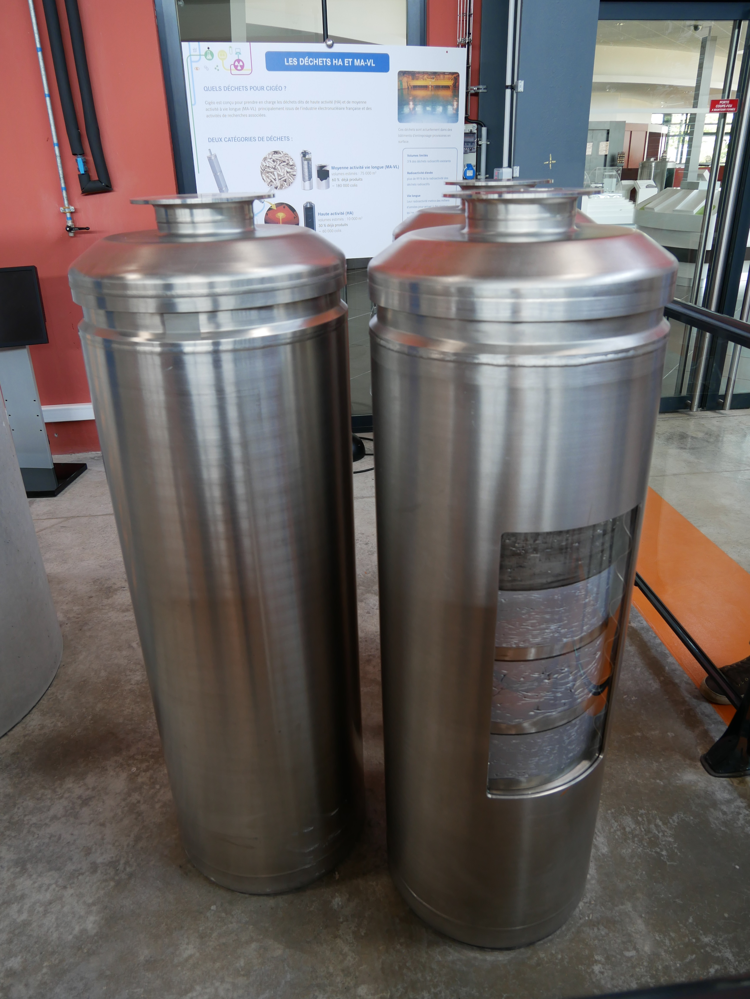

## Présentation de la visite

J’ai été invité par l’agence nationale pour la gestion des déchets radioactifs
(Andra) à visiter le laboratoire souterrain de Bure. C’était une très belle
expérience et cela m’a permis de discuter avec des spécialistes pour mieux
comprendre une question que je serai amené à traiter un jour sur ma chaîne
puisque je vais devoir parler du stockage des déchets radioactifs dans ma série
en cours sur l’énergie. Je vous avais demandé sur
[Facebook](https://www.facebook.com/le.reveilleur/posts/1759815837446052) et
[Twitter](https://twitter.com/Le_Reveilleur/status/1019538942528499712) si vous
aviez des questions. Je vais donc essayer d’y répondre dans cet article en
attendant de traiter le sujet de façon plus exhaustive.

[L’Andra](https://www.andra.fr/) est l’agence publique en charge de la gestion
des déchets radioactifs. C’est un organisme placé sous la tutelle des
ministères chargés de la Recherche, de l’Industrie et de l’Environnement. Cela
veut aussi dire que l’on sépare la question de la gestion des déchets
radioactifs de celle de l’usage du nucléaire militaire ou civil. De toute
façon, même si on arrêtait tout aujourd’hui, on aurait des déchets qu’il faut
gérer. L’Andra ne s’intéresse qu’à la gestion des déchets radioactifs et cet
article ne parlera pas de la pertinence de l’usage du nucléaire.  

Le laboratoire de Bure est un réseau de galeries souterraines à 500 m de
profondeur (je n’étais jamais descendu aussi profond !). Il a pour but
d’évaluer les propriétés de confinement de la formation géologique pour [le
projet
Cigéo](https://www.youtube.com/watch?v=4VETZeT25o8&trk=organization-update-content_share-video-embed_share-article_title)
de stockage des déchets nucléaires. On va donc parler du stockage profond de
déchets nucléaires qui nous amène à une première question que l’on m’a fait
remonter.

## Questions / Réponses

### Quelles sont les alternatives au stockage géologique profond ?

Vu qu’envoyer les déchets nucléaires dans l’espace n’est pas envisageable (ils
sont lourds et ce serait extrêmement dangereux... les fusées explosent plus
souvent que les centrales) et vu que les balancer au fond de l’océan est un peu
passé de mode, il n’y a que trois possibilités.  

Il y a d’abord la transmutation. L’idée serait d’avoir des réacteurs nucléaires
capables de transmuter les éléments radioactifs les plus dangereux en d’autres
éléments. Malheureusement, on est loin d’y arriver, la recherche sur le sujet
n’est pas franchement populaire et ça relève pour l’instant d’une vision
optimiste de l’évolution de cette technologie. De plus, le conditionnement des
déchets déjà produits (vitrification/bitume… etc) rend leur transmutation très
peu probable même si on parvenait à progresser dans cette technologie. Enfin,
le [CEA a montré que la transmutation ne permettait pas de supprimer totalement
les déchets de haute activité à vie
longue](http://www.cea.fr/multimedia/Documents/publications/rapports/rapport-gestion-durable-matieres-nucleaires/Tome%202.pdf).
La transmutation n’est donc pas une alternative au stockage géologique profond
mais un complément potentiel (et probablement trop cher).  

Il y a ensuite l’entreposage en surface ou subsurface. Dans ce cas là, on
garderait toujours sous la main les déchets radioactifs et ils devraient être
surveillés par l’homme pendant des centaines de milliers d’années. Cette
solution n’est pas durable sans une maintenance humaine sur une durée
extrêmement longue. Garantir surveillance et entretien sur une aussi longue
période relève (à mon avis) de la fantaisie. Ce serait une tâche gigantesque,
extrêmement coûteuse pour les sociétés futures, et la probabilité que ce pari
sur l’avenir soit fructueux est (à mon avis) infime.  

Enfin il y a le stockage profond où l’idée est d’enterrer définitivement les
déchets radioactifs. Une fois les déchets enterrés et l’installation fermée,
les déchets n’ont plus besoin de la main de l’homme et ils peuvent lentement
perdre leur radioactivité dans notre sous-sol. Évidemment s’assurer que tout se
passe bien pendant qu’ils sont encore radioactifs est l’enjeu des projets de
stockage mais on voit rapidement que des trois approches possibles, c’est sans
doute la plus crédible. Cette approche est aussi examinée par d’autres pays
(Finlande, Suède, Etats-Unis…) et on fera le point là-dessus dans la future
vidéo.  

Le projet Cigéo est donc le projet français de stockage des déchets radioactifs
en couche géologique profonde et ça nous amène de nombreuses autres questions.  

### Qu’est-ce qu’on y stocke ? Quel volume ? Capacité de stockage du site ?

Le projet Cigéo devrait stocker, au total, 72 000 m3 de déchets radioactifs de
moyenne activité à vie longue (par exemple les gaines qui contiennent le
combustible en centrale) et 12 000 m3 de déchets de haute activité (le
combustible nucléaire usagé du parc nucléaire passé, en exercice et en
construction (EPR de Flamanville)). 62% des 72 000 m3 de déchets radioactifs de
moyenne activité à vie longue ont déjà été produit et 30% des déchets de haute
activité. Le site est conçu pour contenir les déchets radioactifs existants et
ceux qui vont être produits par l’utilisation de notre parc nucléaire. Le
volume prévu peut évoluer avec le projet, il ne s’agit pas d’une limite
technique ou physique.  

### Quelle est la chaleur dégagée par un conteneur ?

Un colis de déchet de haute activité dégage environ 500 W de chaleur au moment
où il arrive dans le site de stockage. Ce dégagement de chaleur ne provoque pas
de dégradation des propriétés de la roche alentour. Si les déchets de haute
activité étaient directement stockés, le dégagement de chaleur serait plus
important (2000 W) et pourrait dégrader les propriétés physico-chimiques de la
roche autour de l’alvéole. C’est pourquoi les déchets de haute activité sont
d’abord refroidis en surface pendant une soixantaine d’années avant de
rejoindre l’éventuel stockage géologique profond.  

### Quelle est la demi-vie typique des déchets de moyenne et haute activité ? Quelle est l’activité de ces déchets ?

Les déchets nucléaires sont classifiés “à vie longue” quand la durée de
demi-vie est supérieure à 31 ans. Pour avoir une idée de la façon dont ces
déchets perdent leur activité au fil du temps, je vous renvoie vers un site du
CNRS qui en parle bien mieux que moi (et avec de jolis graphiques). Jetez un
coup d’œil sur la page dédiée aux déchets de [moyenne activité à vie
longue](http://www.laradioactivite.com/site/pages/Dechets_MAVL.htm) et ceux de
[haute
activité](http://www.laradioactivite.com/site/pages/Effets_Rayonnements_Ionisants.htm).

### Si on trouve un moyen de recycler ces déchets, est-ce que leur extraction sera facile ou bien très coûteuse ?

Le projet d’enfouissement des déchets spécifie que le stockage doit être
réversible tant que le site est en fonctionnement (en gros sur un siècle). On
pourrait donc récupérer ces déchets. Il est cependant peu probable que l’on
trouve un moyen de traiter ces déchets. Même si on avançait très rapidement sur
cette voie (transmutation), le conditionnement des déchets (vitrifié/dans du
bitume… etc) les rend bien plus difficiles à traiter que si ils sortaient d’une
centrale nucléaire. Au bout d’une centaine d’années, le site est définitivement
fermé, il est scellé avec de la bentonite (un type d’argile qui gonfle au
contact de l’eau) et les puits et galeries d’accès seront comblés avec les
remblais. Les déchets deviennent alors inaccessibles et on laisse le temps
faire son oeuvre.  

### Est-on capable de construire une structure qui puisse rester étanche plus de 100/150 ans?

L’idée ce n’est pas d’avoir une structure étanche mais de placer les déchets
dans des structures rocheuses qui ralentissent considérablement la dispersion
des radionucléides. Les éléments radioactifs mettraient tellement de temps à
“circuler” dans la roche qu’ils auraient perdu quasiment toute radioactivité en
atteignant la surface. Au-dessus du site, la radioactivité sur des centaines de
milliers d’années ne devraient pas être discernable de la radioactivité
naturelle présente sur le lieu.  

### Comment va-t-on entretenir cette structure ?

Une fois le site fermé et scellé, la structure n’a pas besoin d’être
entretenue. C’est tout l’intérêt du stockage géologique profond. On réunit les
conditions pour qu’une fois le travail bien fait, il n’y ait rien à entretenir
pour les générations futures.  

### Est-ce qu’il n’y aura pas de gros risques pour les techniciens ?

Pendant l’opération du site, tout est fait pour que les techniciens travaillent
en sécurité, les colis de déchets sont déplacés par des machines et le site est
soigneusement surveillé. Ces activités sont proches de celles qui sont déjà
effectuées sur les sites actuels d’entreposage en surface. Malgré tout, le
risque zéro n’existe pas sur une installation industrielle.  

### Est-il possible ou prévu d’exploiter la chaleur des déchets pour alimenter un réseau de chauffage de maison ou ville à proximité ?

Non. Au delà du coût et de la complexité, la température n’est pas assez élevée
pour que ce soit intéressant (et c’est aussi vrai pour les déchets nucléaires
qui sont refroidis en piscine).  
  
### Pourquoi ne pas carrément enfouir tout cela à 10 km de profondeur ?

Ce n’est pas qu’une question de profondeur. C’est la nature géologique du
terrain qui permet d’assurer que les déchets nucléaires ne remonteront pas à la
surface. De plus, plus on va profond et plus c’est cher, compliqué et dangereux
de faire une installation (ce qui est vrai aussi pour une mine).  

### C’est prévu pour tenir en cas de séisme ?

Oui, l’éventualité d’un fort séisme a été prise en compte dans le projet cigéo.
L’Andra prend même en compte la possibilité d’une ère glaciaire sur la période
concernée (100 000 ans). C’est un sujet qui m’intéresse particulièrement et je
pense faire une vidéo un jour sur l’éventualité d’une nouvelle ère glaciaire.  

### Dans des milliers d’années, le langage et l’écriture auront profondément évolué, comment faire en sorte que les informations transmises à nos descendants leur soient compréhensives ?

C’est une question qui revient souvent surtout que les horizons temporels sont
très longs, plus longs que n’importe quelle civilisation humaine ayant existé.
Le sujet a été (apparemment, je ne l’ai pas vu) bien traité dans le
documentaire Into Eternity sur le stockage en couche géologique profonde de
déchets radioactifs.  

Étrangement, cette question ne m’inquiète pas trop. La probabilité que ça se
passe mal est à mon avis extrêmement faible. Il faudrait (1) qu’une
hypothétique future civilisation ait perdu toute information sur le stockage,
(2) qu’elle creuse exactement où il ne faudrait pas dans une couche géologique
qui a été choisie, entre autres, parce qu’elle ne contient aucune ressource
intéressante. Si (1) reste possible, (2) est assez improbable.  

Et même si le pire devait advenir, j’ai l’impression que l’impact qui en
découlerait est un peu fantasmé. Certes (suivant la date dont on parle), les
personnes entrant en contact avec les déchets pourraient subir de graves effets
sanitaires mais cela se limiterait à un effet local et la leçon serait sans
doute vite apprise. Il ne faut pas trop fantasmer sur les impacts sanitaires de
la radioactivité, ce n’est pas comme si on lâchait un virus sur l’ensemble de
cette hypothétique future civilisation.

L’Andra travaille sur cette question et vous pouvez aller en lire davantage sur
son
approche [ici](https://www.andra.fr/nos-expertises/conserver-et-transmettre-la-memoire).
Mais, ils ont encore du temps avant de devoir faire des propositions.

### Est-ce que les déchets nucléaires dégagent des gaz toxiques et si oui que deviendront ces gaz ?

Les déchets nucléaires peuvent produire de l’hydrogène qui a le vilain défaut
d’être un gaz explosif. C’est, d’après ce que je sais, le principal gaz
problématique émis par les déchets radioactifs. Pendant l’opération du site,
l’hydrogène produit par les déchets est évacué par la ventilation. Après le
scellement du site, l’hydrogène produit par les déchets sera en partie absorbé
par la roche. Etant donné les conditions physiques (température, pression,
vitesse de création), les problèmes que pourraient poser ce type situations
sont identifiés et seront traiter en amont d’une éventuelle autorisation de
l’installation par l’ASN (Autorité de sûreté nucléaire).

### Qu’en est-t-il des déchets bitumineux ? D’autres possibilités de stockage ont elles été envisagées ?

Les déchets radioactifs conditionnés dans du bitume sont donc des déchets qui
présentent des risques d’incendie (à cause du bitume dans lequel ils ont été
conditionnés et non du matériel radioactif). L’autorité de sûreté nucléaire
(ASN) a émis des réserves sur l’enfouissement de ces déchets. Soit
l’installation Cigéo devra être transformée, soit les déchets devront être
reconditionnés. En tout état de cause, les déchets bitumineux qui représentent
18% de l’ensemble des déchets ne seront stockés à Bure que si l’ASN l’autorise
car elle estimera que c’est suffisamment sûr.  

Dans le cas contraire, les déchets pourraient être reconditionné dans autre
chose que du bitume de façon à pouvoir être accepté par le site de stockage ou
il faudra penser à un autre système pour gérer la fin de vie de ces déchets un
peu particulier.  

### Quelles sont les mesures prises en compte pour protéger durablement les nappes phréatiques environnantes ?

La couche géologique dans laquelle le stockage est effectué gardera les
substances radioactives au moins jusqu’à ce qu’elles aient perdu la majorité de
leur radioactivité. Si ces substances devaient finir par atteindre les nappes
phréatiques, elles ne présenteraient plus de danger. Au vu des échelles de
temps en jeu, il n’y a pas beaucoup de différences entre atteindre les nappes
phréatiques et atteindre la surface. Si ces substances arrivent à s’extraire de
la couche d’argilite et arrivent jusqu’aux nappes phréatiques, elles peuvent
rejoindre beaucoup beaucoup plus rapidement la surface.

Pour aller plus loin, vous pouvez lire [le rapport de l’IRSN sur
Cigéo](https://www.irsn.fr/FR/expertise/rapports_gp/Documents/Dechets/IRSN_Rapport-2017-0013_GPDOS-Cigeo_Annexes.pdf).
