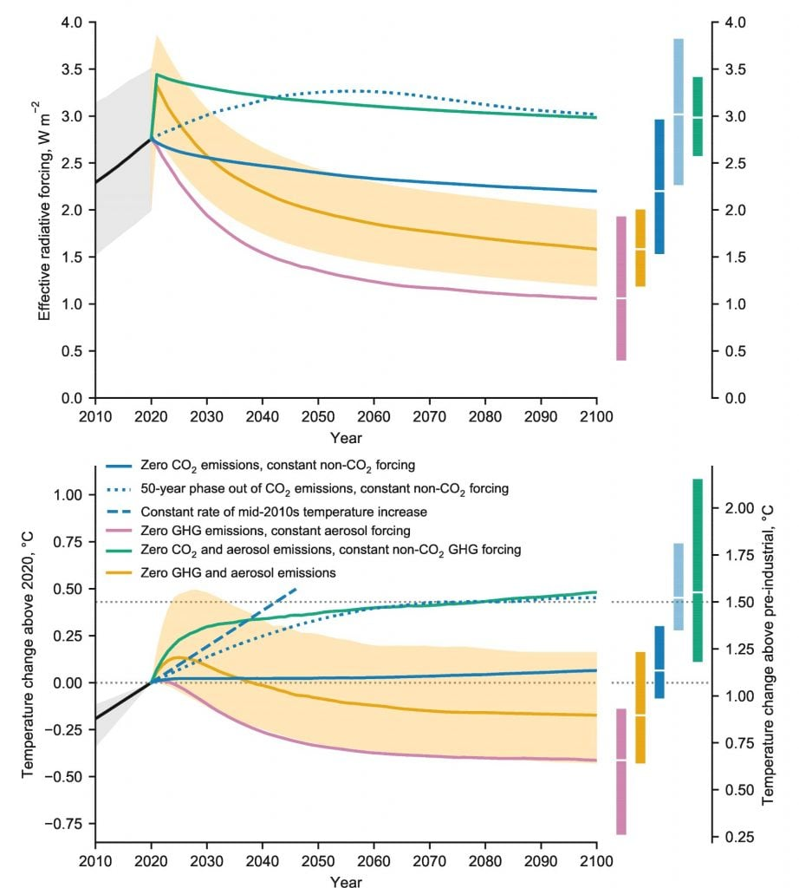
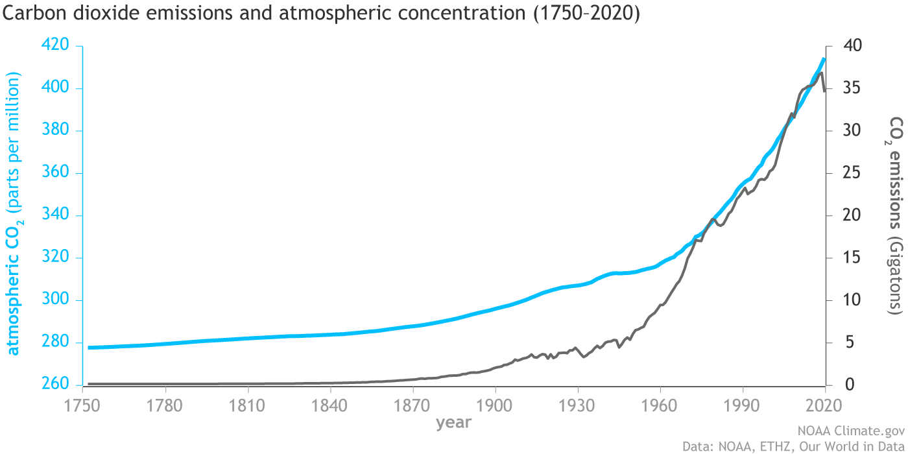
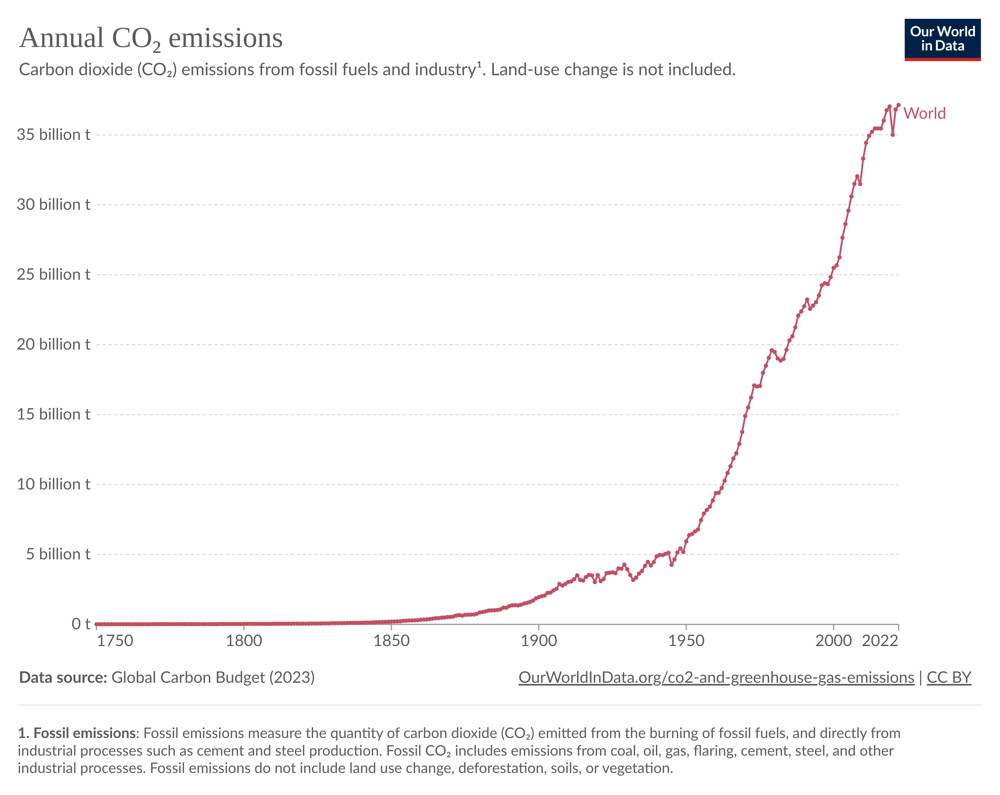
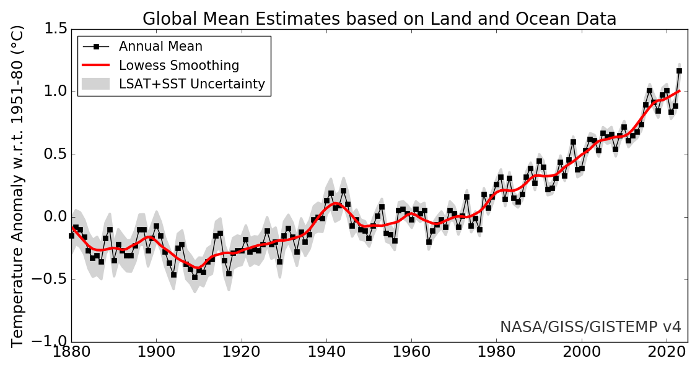

## Sources 

### Meilleures ressources

Pour aller plus loin, vous pouvez lire __l’excellent article__ de Loïc
Giaccone : [Inertie du climat, ou inertie des sociétés
?](https://climatanthropocene.com/2021/11/30/inertie-du-climat-ou-inertie-des-societes/amp/)

Un des meilleurs articles sur ce sujet
(j’en ai tiré la courbe sur la
concentration constante) :
[Explainer: Will global warming ‘stop’ as soon as net-zero emissions are
reached
?](https://www.carbonbrief.org/explainer-will-global-warming-stop-as-soon-as-net-zero-emissions-are-reached)
– CarbonBrief
Il a été [traduit en Français sur le site de Bon
Pote](https://bonpote.com/existe-t-il-vraiment-une-inertie-climatique-de-20-ans/).

### GIEC

#### Figure centrale

La __figure centrale__ de cette vidéo est la figure 1.5 du [Chapitre 1 du
Rapport spécial du GIEC sur les conséquences d’un réchauffement planétaire de
1,5 °C](https://www.ipcc.ch/sr15/chapter/chapter-1/).

#### Sixième rapport du GIEC

- [Sixième rapport du GIEC, GT1, Résumé à l’intention des
décideurs](https://www.ipcc.ch/report/ar6/wg1/downloads/report/IPCC_AR6_WGI_SPM_final.pdf)
– Figure SPM 10
- [Sixième rapport du GIEC, GT1, Résumé Technique](https://www.ipcc.ch/report/ar6/wg1/downloads/report/IPCC_AR6_WGI_TS.pdf) – Infographie TS.1
- [Sixième rapport du GIEC, GT1, Chapitre
1](https://www.ipcc.ch/report/ar6/wg1/downloads/report/IPCC_AR6_WGI_Chapter_01.pdf)
– Figure 1.29 (figure sur les forçages radiatifs)  
- [Sixième rapport du GIEC, GT1, Chapitre
4](https://www.ipcc.ch/report/ar6/wg1/downloads/report/IPCC_AR6_WGI_Chapter_04.pdf)
– FAQ 4.2 (figure sur les forçages radiatifs)

### Je me suis servi des courbes suivantes

- La courbe (NOAA) que j’ai utilisé pour [la concentration
atmosphérique](https://www.climate.gov/media/12990).  
- La courbe Our World In Data sur [les émissions de
CO2](https://ourworldindata.org/co2-emissions).  
- La courbe d’anomalies de température [NASA
GISS](https://data.giss.nasa.gov/gistemp/graphs_v4/).  

### CarbonBrief

À des fins de pédagogie, je me suis permis de considérer que la droite en
pointillé de la figure du SR1.5 correspondrait à un scénario d’émissions
constantes. La FAQ 12.3 du [Cinquième Rapport du GIEC,
GTI](https://www.ipcc.ch/site/assets/uploads/2018/03/WG1AR5_SummaryVolume_FINAL_FRENCH.pdf)
montre bien la quasi-linéarité à court terme de l’évolution des températures
dans un tel scénario. J’ai également ajouté à la figure du SR1.5 un scénario de
concentration constante dont la courbe provient de cet article de CarbonBrief:
[Explainer: Will global warming ‘stop’ as soon as net-zero emissions are
reached
?](https://www.carbonbrief.org/explainer-will-global-warming-stop-as-soon-as-net-zero-emissions-are-reached).

Pour comprendre vers quelle température globale nous oriente les engagements
pris par les pays: [Analysis: Do COP26 promises keep global warming below
2C?](https://www.carbonbrief.org/analysis-do-cop26-promises-keep-global-warming-below-2c)
– CarbonBrief

### Fonte des glaciers en France

- Zekollari, H., Huss, M., and Farinotti, D.: _[Modelling the future evolution
of glaciers in the European Alps under the EURO-CORDEX RCM
ensemble](https://tc.copernicus.org/articles/13/1125/2019/), The Cryosphere,
13, 1125–1146, https://doi.org/10.5194/tc-13-1125-2019, 2019.
- Jouvet, G., & Huss, M. (2019). [_Future retreat of Great Aletsch
Glacier_](https://www.cambridge.org/core/journals/journal-of-glaciology/article/future-retreat-of-great-aletsch-glacier/EB46DC696E0AB9528168F42595EE23D9). _Journal
of Glaciology,_ _65_(253), 869-872. doi:10.1017/jog.2019.52  
- Christian Vincent, Vincent Peyaud, Olivier Laarman, Delphine Six, Adrien
Gilbert, et al.. _[Déclin des deux plus grands glaciers des Alpes françaises au
cours du XXI e siècle : Argentière et Mer de
Glace](https://hal.archives-ouvertes.fr/hal-02414347/)_. _La Météorologie_,
Météo et Climat, 2019.

### Autres

- Les émissions de CO2 ont rebondi en 2021: [Global Carbon
Project](https://www.icos-cp.eu/science-and-impact/global-carbon-budget/2021).
- Michael Mann a abordé cette question sur son blog: [The Best Climate Science
You’ve Never Heard
Of](https://michaelmann.net/content/best-climate-science-you%E2%80%99ve-never-heard)
(la vidéo était déjà tournée)
